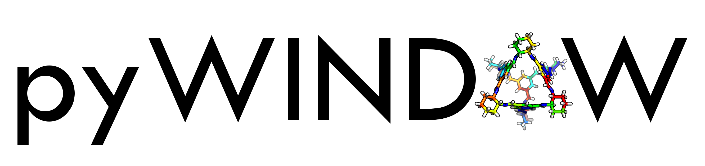

:maintainers:
  `marcinmiklitz <https://github.com/marcinmiklitz/>`_
  `andrewtarzia <https://github.com/andrewtarzia/>`_
:documentation: https://pywindow.readthedocs.io/en/latest/

Overview
========

``pywindow`` is a Python package for the analysis of structural properties of
molecular pores (*porous organic cages*, but also *MOFs* and
*metal-organic cages* - see examples directory).

.. warning::
  This package is currently under development and differs
  from the published
  `pywindow <https://github.com/andrewtarzia/pywindow>`_ but
  should work with Python >= 3.9.

Installation
============

``pywindow`` can be installed with pip:

.. code-block:: bash

  pip install pywindowx

Developer Setup
---------------

To develop with ``pywindow``, you can clone the repo and use
`just <https://github.com/casey/just>`_ and `uv <https://docs.astral.sh>`_
to setup the dev environment:

.. code-block:: bash

  just setup

How To Cite
===========

If you use ``pywindow`` please cite

  https://pubs.acs.org/doi/10.1021/acs.jcim.8b00490
